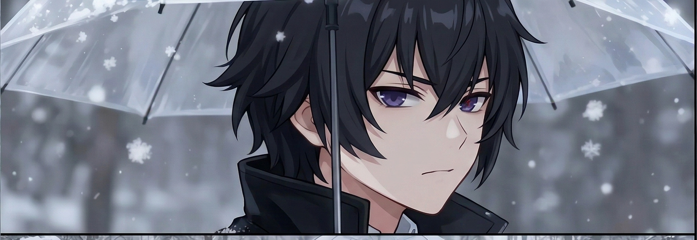

 

&nbsp;

  <picture>
    <source media="(prefers-color-scheme: dark)" srcset="https://raw.githubusercontent.com/dianpurbow/dianpurbow/output/github-contribution-grid-snake-dark.svg">
    <source media="(prefers-color-scheme: light)" srcset="https://raw.githubusercontent.com/dianpurbow/dianpurbow/output/github-contribution-grid-snake.svg">
    
  </picture>

---

  <h3>🧑‍💻 About Me</h3>

  
  

    
  

  

    
Aku Merc

    
    

      

        
👤 <strong>Nickname:</strong> Shin

        
🎓 <strong>Pendidikan:</strong> Universitas Semarang (USM)

        
⚡ <strong>Status:</strong> <em>"Heavenly Demon pernah berkata 美味的点心"</em>

      

      
      

        
💡 <strong>Fokus Utama:</strong>

        <ul style="padding-left: 15px; margin-top: 5px;">
          <li>Software Development</li>
          <li>Artificial Intelligence</li>
          <li>Cloud Computing</li>
          <li>Game Development</li>
          <li>3D Modeling</li>
        </ul>
      

    

    
    

        
🚀 <strong>Sedang Mempelajari:</strong>

        
Django, Laravel, Unreal Engine, Blender

    

    
    

        
<em>"Makasih udah mampir king."</em>

    

  

